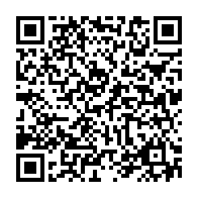

# Урок 1

Начинаем с [видео](https://www.youtube.com/watch?v=xM9x9oJ8Pko&list=PLl58IeyE9-HxTte9IRClUBbrvU_F9WG35&ab_channel=BumbaMediaholding) Ссылка на youtube

Данный файл был записан с видео лекции от Генадия Корнеева. + немного откуда-то ещё))

## Приветствие
Начнём с банального приветствия.
- **Мендвт** - здравствуйте. 
На письме стоит писать так. Произносить же можно как медүт.

> В тодо бичик оно писалось как **менд буй та**  
> Где:  
**мендэ**(здоровье)  
**буй**(или в современном калм. бәәнә, имеется)  
**та** (означает вы) 
>
> Позже некоторые буквы редуцировались. И получилось **мендвт**.
> То есть получается, что мендвт это как буд-то можно перевести как "В здравии ли пожелаете?". Позже менд буй та превратилось в Мендвт.

Конечно, мы не произносим мендвт. Вместо это мы произносим **мундүт**. Но писать нужно как мендвт.

На приветствие, мендвт можно было получить ответ **бәәнә**(есть, присутствует).

> [!NOTE]
> Калмыцкий язык, в старину, звучал на столько не одинаково, в разных местах и у разных племен, что множество людей не понимали друг друга. Об этом написано дореволюцеонных иследователей. Однако на данный момент таких различий **нет**.

>[!NOTE]  
>В старину, когда человек заходили в чужую юрту, то гость не здоровался первым. Всегда первым здоровался представитель старшего поколения человек в юрте. Только после того, как ему хозяин приветствовал, то можно отвечать.

Если мы приветствуем ровестника, то можно сказать **менд** (привет).  
Если мы приветствуем человека старшего поколения, то нужно сказать **мундүт** (здравствуйте)

На приветствие мендвт, так же можно получить ответ **гем уга**.
- **гем** - болезнь
- **уга** - нет
Ответ "гем уга" переводится как "да, всё нормально". Ничего такого нет.

> [!NOTE]  
> Выражение гем уга появлось когда наши предки пришли на нынешние территори. **Гем** - недостаток. Когда старики говорили гемуга.

Ещё одним ответом от стариков, может быть **эн тер го**. Что вместе перводится как: нет ни того, ни другого.
- **эн** - этот
- **тер** - тот
- **го/уга** - нет, отсутствует  

Можно так же написать "Мендвт?", то это переведётся как "как ваше здоровье".

Ещё одним ответом может стать **му биш** Что переводится как не плохо не хорошо.
- **му** - плохо
- **биш** - частица нет   

Так старики говорят, чтобы не наслать несчастье на семью, сглаза. Получается, что и не говорили, что всё хорошо, но и не плохо, чтобы не сглазить.
_______

## Алфавит

В калмыцком алавите **39** букв. 32 из русского алфавита и 6 калмыцких.  
ә ө ү һ җ ң

:heavy_exclamation_mark: Буква э произносится не как в русском алфавите. Она определеяет другой звук. Оно ещё иногда записывается как е

### Правило сингармонизма

Кажется что слово сингармонизм не стоит запоминать, но звучит оно очень круто. Можно попробовать запомнить.  
Но что стоит запомнить так это само правило:
Все гласные в калм. языке делятся на 2 группы:
- **эр эгшг** или твёрдые гласные а, о, у, ы, ю, я
- **эм эгшг** или мягкие гласные ә, ө, ү, э, и
И в одном слове могут быть гласные только из одной группы. **ТОЛЬКО ЧТО-ТО ОДНО**  

> [!NOTE]
> На самом деле это не только в калм. языке есть такое правило. В других тоже есть.

> [!IMPORTANT]
> Прежде чем продложим нужно кое о чём договорится. 
> Есть проблема. Кириллица не очеь помогает с тем, чтобы корректно отображать как слово должно произносится.  
> Например это 2 разных слова, которые произносятся правильно:
> - эм \- лекарство
> - эм \- женское, самка  
> Видите разницу? А она есть\)\)\)  
> Будьте внимательны. Смотрите как оно произносится. Если слово будет встречатся в первый раз, то мы будем отмечать их красным кружочком o (неясная гласная)

Так же в калм. языке есть разделение на долгие гласные и короткие гласные.  
Давайте посмотрим на пример.
В видео красным кружочком будет отмечятся редуцированная гласная

|Кратккие|Долгие|
|----|----|
|**авoг**(высокомерие)|**аавo**(дедушка, отец)|
|**әмнoн**(жизнь)|**бәәдн**(есть)|
|**одoн**(звезда)|**ооср**(шнурок)|
|**өр**(утро)|**өөрoд**(ойрат)|
|**усoн**(вода)|**уллo**(гора)|
|**үдo**(обед)|**үүдoн**(дверь)|
|**ичoр**(стыд)|**киитн**(холод)|
|**эм**(лекарство)|**ээхo**(греть)|

### Калмыцкие согласные
**уһахo** (мыть, стирать убирать).
> В слове уһах буква а произносится чуть дольше.

**Солoңһo** (радуга)
**җирһoл** (счастье)
**көгoлoҗoрһoн** (голубь)

**соңoсхo** (слушать, слышать)
**савoң** (мыло)
> савң приходит из арабского языка

> [!IMPORTANT]
> Про буквы һ. Если буква г стоит в начале слова, то она читается как руская г.

**һаха** (свинья)
**һалун** (гусь)
**һосoн** (сапог)

> [!IMPORTANT]
> Любые слова которые заканчиваются на **һ** нужно читать как буд-то после һ есть неясная гласная 
> **медoлһo** (познаваемый объект)

На том моментне заканчивается запись о видео. 

Немножко оторвёмся.  
Выписка из практического курса калмыцкого языка.  

> Буква Ф используется только для написания заимствованных слов.

> Гласные звуки практически не редуцируются. Это значит, что неважно в каком месте слова  
> стоит буква. Она будет произносится одиково.

> Ударение **всегда** падает на последний слог, даже если гласная в нём не явная.

### Новые cлова

Здесь и далее будут преведены слова, которые встретились в уроке. Дополнительно, эти слова будут проверятся в словаре. У меня есть физ. копия словаря "Я изучаю калмыцкий 2-е издание доработанное и дополненное". Если слово будет иметь несколько переводов, то они будут указаны тут. Не все. Поэтому стоит всё таки заглянуть в словарь.

|Слово на калмыцком|Перевод|
|----|----|
|мендвт|здравствуйте (обращение на вы)|
|менд|1. здоровье; благополучие 2. привет; здравствуй (обращение на ты)|
|бәәнә|есть; имеется (будьте аккуратны, слово имеет множество вариаций)|
|гем|1. болезнь; повреждение 2. вина, провинность, проступок|
|уга|нет, отсутствие, отсутствующий|
|эн|этот|
|тер|тот|
|му|плохой, дурной, ужасный|
|биш|1. частица отрицания 2. другой|
|эр|1.1 мужчина 1.2 мужской пол|
|эм|1. лекарство 2.1 женищина 2.1 мужской пол|
|ав|высокомерия|
|аав|1. дедушка 2. отце|
|әмн|жизнь|
|бәәдн|есть|
|одн|звезда|
|ооср|1.1 шнурок 1.2 верёвка 2.1 ошейник 2.2 кабала (в переносном значении)|
|||
|||
|||
|||
|||
